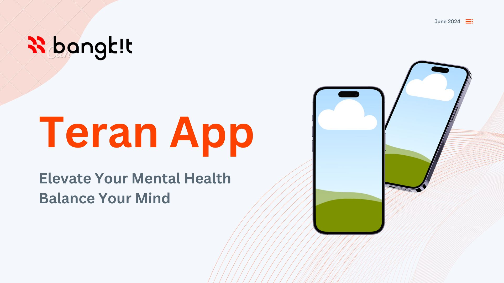

# C241-PS061 - Bangkit 2024 Capstone Team Project (Teran)

Hello there! 👋 Welcome to the world of team C241-PS061! We are a group of passionate individuals on a mission to Empowering Vulnerable Communities for Health and Well-being

## 🌏 Project Overview

Our team developed Teran to address prevalent stress issues among students, informed by personal experiences. Leveraging machine learning, we detect stress probabilities and utilize cloud services for secure data storage. Teran aims to empower individuals, particularly students, with stress management knowledge. Features include a survey tool for stress level assessment and journal to just confide in ourselves through notes. Additionally, a network feature facilitates sharing stories among students facing similar challenges.

## 👥 Meet Our Extraordinary Team

Let us introduce you to the masterminds behind this groundbreaking project. Each team member brings their unique expertise, unwavering dedication, and a shared passion for making a real impact.

- [active] M281D4KX3241 - Tasya Ade Amelia - Universitas Negeri Medan - ML
- [active] M129D4KX2350 - Eka Sulistyaningsih – Politeknik Negeri Jember - ML
- [active] M004D4KY2039 - Royhan Nurisalam – Institut Teknologi Sepuluh Nopember - ML
- [active] C193D4KY0367 - Muhammad Dariaz Zidane – Universitas Bina Sarana Informatika - CC
- [active] C129D4KX0459 - Lusy Damayanti – Politeknik Negeri Jember - CC
- [active] A247D4KY3887 - Muhammad Ervan Fadillah – Universitas Lambung Mangkurat - MD
- [active] A524D4KY4068 - Arry Kusuma Putra – Politeknik Negeri Banjarmasin - MD

## 📞 Contact Us

Have questions, ideas, or just want to say hello? Reach out to us through the following channels:

- Email: teran@gmail.com

Let's embark on this fruitful journey together! 👋✨

## 🌞 Contributors

